  

# 👋 I'm Jessica Borges

**Financial Fraud Investigator → Cybersecurity & Secure Backend Development**

📍 Spain (Remote / Hybrid / Relocation) · 🌐 [LinkedIn](https://linkedin.com/in/jessica-borges-cyber) · 🛡️ [Cybersecurity Portfolio](https://github.com/Borgesjesk/Cybersecurity-Portfolio) · ✉️ [Email Me](mailto:jessborgesb@gmail.com)

---

## 🚀 Why Hire a Fraud Investigator for Security?

Because I've spent **6+ years catching threat actors in the real world** — and now I build systems that stop them in code.

At **Wtransnet (Alpega Group)**, I ran KYC verification, risk analysis, and cross-border dispute resolution across European markets. I investigated fraudulent companies, analyzed behavioral patterns, and made high-stakes decisions under pressure — the exact skills SOC Analysts and DevSecOps engineers use every day.

This isn't a career change. It's the **same mission, new tools.**

---

## 🎓 Current Training (2026)

| Program | Status | Focus |
|---------|--------|-------|
| **IT Academy Barcelona Activa** — Java Backend Bootcamp | Sprint 3 of 5 (Design Patterns) | Java 21, Maven, JUnit 5, Spring Boot, REST APIs, MySQL, MongoDB |
| **Ironhack IFCT0109** — Seguridad Informática (500h) | In Progress (May–Dec 2026) | Certificado de Profesionalidad + CompTIA Security+ |
| **Google Cybersecurity Professional Certificate** | 7/8 Courses Complete | NIST, SIEM, Linux, SQL, Python, Incident Response |
| **42 Barcelona** | Accepted (Piscine June 2026) | Low-level programming, C, systems |

---

## 🛠️ Technical Toolbox

**Languages & Frameworks**
Java 21 (OOP, Generics, Streams, Lambdas) · SQL (MySQL, MongoDB) · Python · Spring Boot · Maven · JUnit 5

**Security & Defense**
Wazuh SIEM · Splunk · Suricata IDS · Wireshark · John the Ripper · NIST CSF / SP 800-53 · OWASP Top 10 · Linux CLI · IAM & Least Privilege

**DevOps & Tools**
Git · Docker · WSL · IntelliJ IDEA · Conventional Commits · CI/CD fundamentals

**Soft Skills**
Trilingual (EN / ES / PT) · International Mediation · KYC & Due Diligence · Crisis Decision-Making

---

## 📊 Fraud Investigation → Security Engineering

| 🔍 Fraud Investigation (6+ Years) | 🛡️ Technical Security Application |
|---|---|
| KYC Verification & Identity Fraud Detection | Authentication, IAM, Zero Trust |
| Financial Dispute Mediation | Logic-driven Debugging & Root Cause Analysis |
| EU Transport Regulation Compliance | GRC (Governance, Risk & Compliance) |
| Behavioral Pattern Analysis | Threat Detection & SIEM Triage |
| Crisis Management & Escalation | Incident Response & System Reliability |
| Cross-border Investigation Coordination | SOC Workflows & Collaborative Triage |

---

## 📁 Featured Projects

### ☕ Java Backend (IT Academy)

| Sprint | Focus | Repo |
|--------|-------|------|
| S1.01–S1.09 | OOP, Inheritance, Interfaces, Generics, Streams, Lambdas, File I/O, JUnit 5 | [Sprint 1 Series](https://github.com/Borgesjesk?tab=repositories&q=s1&type=&language=java) |
| S2.01–S2.04 | MySQL, MongoDB, Docker, Schema Design, Complex Queries | [Sprint 2 Series](https://github.com/Borgesjesk?tab=repositories&q=s2&type=&language=) |
| S3.xx | Design Patterns (in progress) | Coming soon |

### 🛡️ Cybersecurity

- **NIST 800-53 Risk Assessment** — Vulnerability analysis and control implementation
- **SQL Security Investigation** — Auditing access logs for unauthorized entry patterns
- **Linux IAM** — Managing permissions with Principle of Least Privilege
- **42 Barcelona Piscine Ciberseguretat** — CTF challenges: ROT13 binary reversing, AES-CBC decryption, OSINT, hash cracking
- **TryHackMe SOC Level 1** — Active learning path

---

## 🎯 What's Next

- **Now:** Completing Sprint 3 (Design Patterns) + starting Ironhack IFCT0109
- **Target Role:** SOC Analyst L1 / Junior Security Engineer (Q3–Q4 2026)
- **Growth Path:** SOC → DevSecOps → Senior DevSecOps (Remote EU/US)
- **Availability:** Open to remote, hybrid, or relocation within Spain & EU

---

> *"Professionalism is the bridge between code and business value."*

